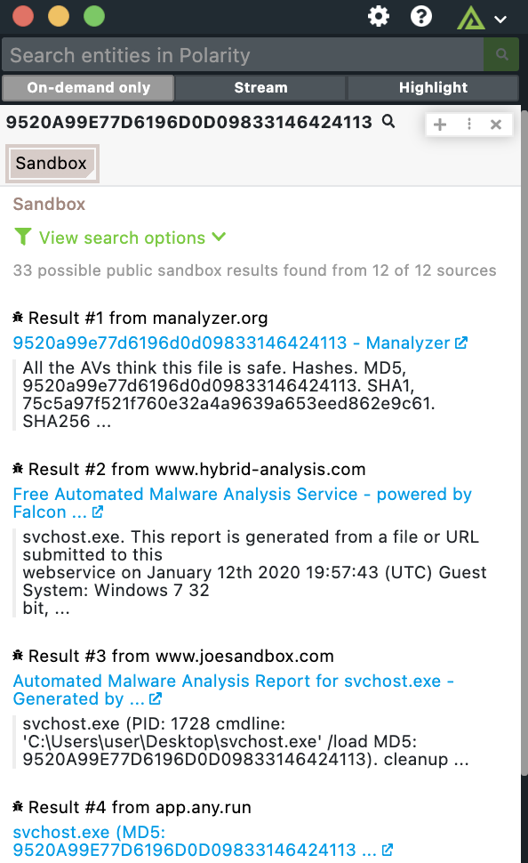

# Polarity Sandbox Integration

The Polarity Sandbox integrations uses the Google search API to search malware on different internet hosted sandboxes, to provide more information on the malware hashes. 

|
|---|---|
|*Sandbox example* |

## Sandbox Integration Options

### API Key

Valid Google CSE API Key

### Sandboxes to Search 
Specify which Sandboxes you want the integration to search. 

## Installation Instructions

Generate a new CSE API key on the following page:

https://developers.google.com/custom-search/v1/overview

A free account allows for up to 100 search queries per day.

Once the API key has been generated, input the information into the API Key field in the integration and start searching for exploits. 

## Polarity

Polarity is a memory-augmentation platform that improves and accelerates analyst decision making.  For more information about the Polarity platform please see:

https://polarity.io/
